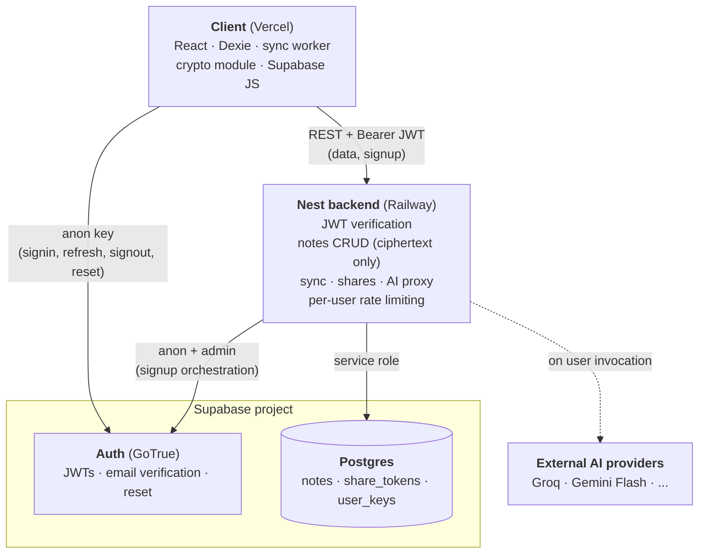

# Backend & sync — design doc

This document specifies the rollout that takes Ardoise from a single-device offline-first scratch-pad to a multi-device synced product with authentication, end-to-end encryption, AI-assisted features, and read-only sharing.

It is written as an implementation reference: each section captures what something is, the decision and why, how it works, and what depends on it.

---

## 1. Goals & non-goals

**Context.** Ardoise today is a single-device offline-first markdown scratch-pad. State lives in Dexie; there is no account, no backend, no network dependency. This rollout adds a backend, authentication, multi-device sync, end-to-end encryption, AI-assisted features, and read-only sharing — without losing the local-first behavior that defines the product.

### Goals

- **Multi-device sync.** A user signs in on any device with the same account and sees the same notes. Edits made on one device propagate to others.
- **Preserved offline-first behavior.** Writes succeed locally even when offline. The network is a propagation layer over the local store, never a precondition for a usable app.
- **End-to-end encryption.** Note content is encrypted on the client with a key the server never sees. The server stores opaque ciphertext at rest.
- **Authenticated accounts.** Email + password signup with email verification. Password reset. Recovery code generated at signup so a forgotten password is not unconditionally fatal.
- **Mobile read access.** Notes are readable on a phone via an installable PWA. Mobile editing is not v1.
- **Read-only sharing.** A note can be shared via a link that grants read access without requiring the recipient to have an account, while remaining e2ee on the server side.
- **AI-assisted features.** A general direction rather than a fixed set: speech-to-text capture, text rewriting/formatting, and tag suggestions are likely first candidates, but the doc treats AI as an open-ended surface served by a provider proxy at the backend.
- **Graceful adoption.** Existing local-only Dexie data is preserved when a user first signs in: their local notes become the initial state of their account.

### Non-goals

- **Real-time collaborative editing.** No concurrent-edit merge, no operational transforms, no CRDT. Sync is single-writer-at-a-time with last-write-wins on conflicts.
- **Team / workspace / multi-tenant features.** Each account is an individual; there are no shared workspaces, member roles, or org-level permissions.
- **Server-side search or filters over note content.** E2EE makes this structurally impossible. Search remains entirely client-side.
- **Native mobile apps.** No React Native, Capacitor, or app-store builds. The mobile experience is the PWA.
- **Self-hosting story for other users.** The codebase will be open enough to self-host in principle, but the deployment is single-instance and not designed as multi-tenant SaaS.
- **Account recovery without the recovery code.** Lost password *and* lost recovery code = lost data, by design. This is the cost of e2ee and will be communicated clearly during signup.
- **Public or anonymous note creation.** All writes require an authenticated account.
- **Plugin / third-party extension API.** Not in scope.
- **AI features that work offline.** The AI surface always requires network and a provider; there is no local LLM fallback.

### Non-functional commitments

- **Privacy boundary.** The server has no access to plaintext note content at rest. The only time plaintext crosses the server boundary is during an explicit AI invocation, where the user has triggered an action that requires it. The UI surfaces this when it happens.
- **Cost envelope.** Personal-scale hobby hosting. Target ≤ $10/mo infra for both beta and prod combined at launch, scaling only with actual users.
- **Resilience.** Network failures, mid-flight tab closes, and backend outages must never lose a user's writes. The local store is durable and authoritative; sync is best-effort with retry.
- **Incremental delivery.** No big-bang cutover. Each merged commit leaves the app in a usable, shippable state. The current local-only product remains the user experience until the synced flow is opt-in and stable.
- **Local-as-canonical.** The Dexie store remains the source of truth on the client. The backend is a propagation and storage layer; the client never has to round-trip the network to read its own data.

---

## 2. System architecture

### Components



The client talks to two things: **Supabase Auth** directly (for signup / signin / token refresh) and the **Nest backend** for everything data-related. The client never reaches Postgres directly — all data access is mediated by the backend, which lets us own validation, rate limits, and future business logic without inventing RLS policies for every shape.

The backend talks to Supabase Postgres using a service-role key (full access; security is enforced in app code, not RLS) and to AI providers on behalf of authenticated users.

### Stack

| Layer | Choice | Notes |
|---|---|---|
| Client framework | Vite + React + TypeScript | Existing. |
| Local store | Dexie (IndexedDB) | Existing. Source of truth on the client. |
| Client crypto | Web Crypto API | Native, no dependency. AES-GCM + PBKDF2/Argon2id (via WASM lib if Argon2id chosen — see §5). |
| Auth client | `@supabase/supabase-js` | For signup / signin / session. JWTs forwarded to the Nest backend. |
| Backend framework | Nest.js (Node 20+) | Familiar shape, opinionated structure, TypeScript end-to-end. |
| Backend JWT | `jose` (or `@nestjs/jwt`) | Verifies Supabase JWTs via the project's JWKS endpoint. |
| DB | Supabase Postgres | Schema versioned via Supabase CLI migrations. |
| Auth provider | Supabase Auth (GoTrue) | Email + password, email verification, password reset. |
| Object storage | Supabase Storage | Added later, with STT (audio uploads). Not v1. |
| Shared package | `packages/shared` | Isomorphic TS: types, Zod schemas for API contracts, pure entity helpers, constants. No platform APIs, no heavy deps. |
| Client host | Vercel | Existing. |
| Backend host | Railway | Two environments: `beta`, `production`. |

### Monorepo layout

```
ardoise/
├── apps/
│   ├── client/                # existing Vite app, moved under apps/
│   └── api/                   # new Nest.js backend
├── packages/
│   └── shared/                # types shared between client and api
├── supabase/
│   ├── migrations/            # versioned SQL migrations
│   └── config.toml            # Supabase CLI config (local dev)
├── docs/
├── package.json               # workspace root (npm workspaces)
└── tsconfig.base.json         # shared TS config
```

**Decisions worth naming.**

- **npm workspaces, not pnpm or turbo.** The repo already uses npm; introducing pnpm or turbo would be a separate concern. Workspaces are enough for our scale (3 packages, one CI pipeline).
- **No editor extraction in v1.** The editor stays inside `apps/client/src/editor/`. Extraction was discussed and deferred — there is no second consumer to justify the cost yet. The monorepo's value is shared types, which `packages/shared` already provides.
- **`supabase/` at the root** (not under an app) because the Supabase CLI assumes that location for migrations and config. Both apps reference the same database; the migrations belong to the project, not to either deployable.
- **`packages/shared` holds isomorphic code**: types, Zod schemas for API contracts (see §7), pure entity helpers (`isDirty`, `isTombstoned`, `isShareExpired`, …), and constants. The rule is "runs unchanged in Node and the browser, no heavy runtime deps, no platform APIs." Anything calling Web Crypto, Dexie, `fs`, or pulling in a fat SDK belongs in its consuming app, not here.

### What stays out of the monorepo

- Vercel and Railway configuration lives in each platform's UI/CLI, not in repo files beyond a Dockerfile / `vercel.json` if needed. Environment secrets are platform-managed (see §12).
- The Supabase project itself is a hosted resource managed via the dashboard and CLI; only its schema and CLI config are version-controlled here.

---

## 3. Data model

### Encryption boundary

The server stores **only opaque ciphertext and the metadata required for sync mechanics**. Everything a user would consider "the note" — title, body, tags, pinned/archived state, per-note settings — is encrypted into a single payload before it leaves the client.

| Visible to server | Encrypted into payload |
|---|---|
| `id` (UUID, client-generated) | title |
| `owner_id` | body (markdown) |
| `version` (monotonic, server-assigned) | tags |
| `updated_at`, `created_at`, `deleted_at` | pinned / archived flags |
| `ciphertext` + `ciphertext_iv` (opaque blob) | per-note settings |
| ciphertext size (inherent) | |

What the server *can* infer: the user has N notes, each of approximate size S, with timestamps T. It cannot infer titles, content, tags, or which notes are pinned. This is the minimum metadata leakage compatible with a sync server.

### Postgres tables

The schema is versioned via Supabase CLI migrations under `supabase/migrations/`. The `auth.users` table is managed by Supabase Auth and referenced via foreign key but never written to by application code.

**`notes`** — one row per logical note.

| Column | Type | Notes |
|---|---|---|
| `id` | `uuid` PK | Client-generated. Same UUID across all of a user's devices. |
| `owner_id` | `uuid` FK → `auth.users(id)` | Indexed. |
| `ciphertext` | `bytea` | AES-GCM encrypted payload (see §5). Includes title, body, tags, flags. |
| `ciphertext_iv` | `bytea` | 12-byte nonce for AES-GCM. New nonce per encryption. |
| `version` | `bigint` | Server-assigned, monotonic per note. Incremented on every successful write. |
| `updated_at` | `timestamptz` | Client-stamped (with server-side bound to prevent absurd values). LWW tiebreaker. |
| `created_at` | `timestamptz` | Server-assigned on first insert. |
| `deleted_at` | `timestamptz` nullable | Soft delete. Row remains so other devices can sync the deletion. Hard-pruned by a background job after a retention window. |

Indexes: `(owner_id, updated_at DESC)` for sync pulls; `(owner_id, id)` is the natural PK lookup.

**`user_keys`** — wrapped data-encryption key per user. Details and the key hierarchy are specified in §5; this table is its at-rest representation.

| Column | Type | Notes |
|---|---|---|
| `user_id` | `uuid` PK FK → `auth.users(id)` | One row per user. |
| `kek_password_salt` | `bytea` | Salt for password → KEK derivation. |
| `kek_recovery_salt` | `bytea` | Salt for recovery-code → KEK derivation. |
| `wrapped_dek_by_password` | `bytea` | DEK encrypted with password-derived KEK. |
| `wrapped_dek_by_recovery` | `bytea` | DEK encrypted with recovery-derived KEK. |
| `kdf_params` | `jsonb` | KDF algorithm and parameters (algo, memory, iterations) for forward compatibility. |
| `created_at` / `updated_at` | `timestamptz` | |

**`share_tokens`** — read-only share links.

| Column | Type | Notes |
|---|---|---|
| `token` | `text` PK | Random URL-safe string. Used in share URLs. |
| `note_id` | `uuid` FK → `notes(id)` | The shared note. |
| `owner_id` | `uuid` FK → `auth.users(id)` | For owner-scoped revocation queries. |
| `created_at` | `timestamptz` | |
| `expires_at` | `timestamptz` nullable | Optional expiry. |
| `revoked_at` | `timestamptz` nullable | Set when owner revokes. Row kept for audit. |

The note's decryption key is **not** stored server-side. It lives in the URL fragment (`#k=...`), which browsers do not send to servers. Sharing details are in §9.

No `processed_ops` / dedup table. Idempotency is enforced by the optimistic version check (see §6): a retry pushing `parent_version=N` against a note already at `version=N+1` is a no-op rather than a duplicate insert.

### Dexie tables (client)

The existing `notes` table evolves; two new tables are added.

**`notes`** — plaintext, as currently. Adds three sync-related fields:

| Field | Notes |
|---|---|
| existing fields (`id`, `title`, `body`, `tags`, `pinned`, `archived`, `updatedAt`, …) | Unchanged in shape. |
| `version` | Last server-assigned version known for this note. `0` if never synced. |
| `dirty` | Boolean. True when local changes have not yet been pushed (i.e. an outbox entry exists). Used for UI hints and conflict detection on pull. |
| `serverUpdatedAt` | The `updated_at` last seen from the server. Used as the LWW tiebreaker on conflict. |

**`outbox`** — pending writes to the backend.

| Field | Notes |
|---|---|
| `opId` | UUID. Client-generated; survives retries unchanged. |
| `noteId` | The note being written. |
| `ciphertext`, `ciphertextIv` | The encrypted payload to send. |
| `parentVersion` | The `version` the local edit was based on. Sent to the server for optimistic concurrency. |
| `attempts` | Retry counter. |
| `lastAttemptAt` | For backoff scheduling. |
| `lastError` | Optional. For surfacing persistent failures in UI. |

Outbox is drained FIFO per note (across notes, order doesn't matter). See §6 for the worker loop.

**`syncMeta`** — singleton-ish, one row per logical sync stream.

| Field | Notes |
|---|---|
| `lastPullAt` | Timestamp of last successful pull. |
| `lastPullCursor` | Highest `updated_at` seen on the server in the last pull. Used as the `since` cursor for the next pull. |

### Why this shape

- **Single `notes` table on the server**, no separate `note_versions` history. History is out of scope for v1; if we want versioning later it's an additive table, not a redesign.
- **Version on the server, timestamp on the client**, both present. The server-assigned `version` is the optimistic-concurrency primitive (cheap, monotonic, unambiguous). The client-stamped `updated_at` is the LWW tiebreaker on conflict. Using only one of them is tempting but each handles a different failure mode (concurrent push vs which-edit-wins).
- **Soft delete with retention**, not hard delete. Other devices need to learn about deletions on their next pull. After a retention window (proposed: 30 days), a background job purges the rows. Until then the row carries only `id`, `owner_id`, `deleted_at` — no ciphertext.
- **Wrapped DEK in Postgres, not client-only.** Storing the wrapped DEK server-side is what enables signin on a new device: the device authenticates, fetches the wrapped DEK, and unwraps it with the password. The DEK itself is never readable by the server because it's wrapped.
- **Share tokens are tiny and revocable.** The expensive part — the decryption key — is in the URL fragment, so revoking the token at the server kills access. Details in §9.

---

## 4. Authentication

Authentication is handled by **Supabase Auth (GoTrue)**, not rolled in-house. The client talks to Supabase Auth directly for signup, signin, refresh, and reset. The Nest backend never sees passwords; it verifies the JWTs Supabase issues.

### Why Supabase Auth

- Email verification, password reset, rate limiting, refresh-token rotation, secure session cookies — all standard and pre-implemented.
- One less thing to operate. Rolling our own would consume weeks for no product gain.
- Supabase's `auth.users` table is the foreign-key target for `notes.owner_id` and `user_keys.user_id`, which keeps the data model coherent.

The client uses `@supabase/supabase-js` directly for **signin, refresh, signout, email verification, and password reset** — there's no benefit to proxying these, and `supabase-js` handles session storage and refresh token rotation cleanly. The one exception is **signup**, which is proxied through the backend so that account creation and `user_keys` insertion happen atomically (see "Signup flow" below).

### Signup flow

Signup is the one auth operation that goes through the backend rather than direct to Supabase. The reason: account creation and `user_keys` insertion need to be atomic. A direct-Supabase signup followed by a separate `POST /auth/setup` leaves a window where the Supabase user exists but has no `user_keys` row — if the second call fails durably, the account is permanently broken and the client cannot roll back (the anon key can't delete users). A proxied signup with a compensating delete on the server avoids this.

1. User enters email and password in the client.
2. Client generates all e2ee material locally (see §5): random DEK, two random salts, derives the password-KEK, derives the recovery-KEK from a freshly generated recovery code, wraps the DEK twice. The recovery code is shown to the user *before* the network call, with a "I've saved it" confirmation gate.
3. Client POSTs everything in one request to `POST /auth/signup`:
   ```
   { email, password,
     kekPasswordSalt, kekRecoverySalt,
     wrappedDekByPassword, wrappedDekByRecovery,
     kdfParams }
   ```
4. Backend orchestrates atomically:
   - Calls `supabase.auth.signUp({ email, password })` using a server-side **anon** Supabase client. Supabase creates the unverified user, sends the verification email, returns a session.
   - Inserts the matching `user_keys` row using the `user.id` from the returned session.
   - On any failure during insertion, calls `supabase.auth.admin.deleteUser(userId)` (service-role client) to roll back the Supabase user, then returns the error.
5. On success, the backend returns the Supabase session to the client.
6. Client installs the session via `supabase.auth.setSession(...)` and stores the DEK in memory and in IndexedDB (`deviceKeys`). Plaintext notes can be created locally immediately; sync waits for email verification.

The backend sees the plaintext password only transiently to forward it to Supabase; it is never logged and never persisted. After this one call, the client uses Supabase Auth directly for the rest of the auth lifecycle (signin, refresh, signout, reset).

### Email verification

User can sign in before verifying their email, but **sync is gated on verification**. Until the email is confirmed:

- The client treats the account as local-only — notes go into Dexie, no outbox push.
- A banner prompts the user to verify and offers to resend the email.
- Once verified (Supabase event), the outbox starts draining and an initial pull runs.

This avoids a class of abuse (creating accounts to spam the AI proxy) without making signup feel slow.

### Signin flow

1. User enters email and password.
2. Client calls `supabase.auth.signInWithPassword({ email, password })`. Receives access token (JWT) + refresh token, persisted by `supabase-js`.
3. Client fetches `user_keys` for this user from the backend: `GET /auth/keys`.
4. Client derives the password-KEK using the returned `kek_password_salt` and `kdf_params`, then unwraps `wrapped_dek_by_password` to recover the DEK.
5. DEK is held in memory and stored in IndexedDB (`deviceKeys`) so subsequent sessions on this device don't re-prompt.
6. Initial pull runs: backend returns all notes for this user (full ciphertext); client decrypts with the DEK and populates Dexie.

If step 4 fails (wrong password, or DEK rewrapped since last login): fall through to the recovery-code path (see "Forgotten password" below).

### Subsequent sessions on the same device

The Supabase session is auto-refreshed by `supabase-js`. The DEK is already in `deviceKeys`. No prompt; the app opens directly into the editor. This is the common path.

### Signout

- Wipes the Supabase session.
- Wipes the DEK from `deviceKeys`.
- **Optionally** wipes plaintext notes from Dexie (offered to the user; default is to wipe, with a checkbox to keep local-only). Keeping them around after signout would defeat the local-encryption story for shared devices.

### Forgotten password — the e2ee twist

The standard Supabase password reset flow gets the user back into their *account* but not into their *data*. Password reset rotates the password Supabase uses for authentication, but the DEK is wrapped by a KEK derived from the **old** password — the new password unwraps nothing.

So the flow is two-stage:

1. **Account recovery (Supabase Auth).** User clicks "Forgot password," receives the standard reset email, sets a new password. They can now sign in.
2. **Data recovery (recovery code).** On first signin after reset, the client tries to unwrap with the new password-KEK and fails. The UI prompts: *"Enter your recovery code to restore access to your notes."* Client derives the recovery-KEK, unwraps `wrapped_dek_by_recovery`, recovers the DEK, then re-wraps with the new password-KEK and PUTs the updated `wrapped_dek_by_password` to the backend.

If the user has lost the recovery code as well, their notes are unrecoverable. The UI offers to wipe and start fresh. This is communicated explicitly at signup ("Save this recovery code somewhere safe — it is the only way to recover your notes if you forget your password").

### Password change (user knows current password)

Different from reset. User enters old password and new password.

1. Client verifies old password with `supabase.auth.updateUser({ password: new })`.
2. Client derives new password-KEK from new password + existing `kek_password_salt`.
3. Client re-wraps the DEK with the new KEK.
4. Client PUTs `{ wrapped_dek_by_password }` to the backend. Recovery slot is untouched.

No data is re-encrypted. Only one small blob in `user_keys` changes.

### Backend JWT verification

The backend never authenticates with passwords. Every request must carry `Authorization: Bearer {access_token}` where the token is a Supabase-issued JWT.

A Nest auth guard:

1. Extracts the bearer token.
2. Fetches the JWKS from the Supabase project (`https://{project}.supabase.co/auth/v1/keys`, cached with a TTL).
3. Verifies signature, `exp`, `iss` (must match the Supabase project), and `aud=authenticated`.
4. Extracts `sub` → `user_id`, attaches to the request context.
5. Rejects with 401 on any failure.

Endpoints requiring auth declare it via a decorator; share-link endpoints (see §9) and a small public surface (health check) are explicitly unauthenticated.

### What the backend never does

- See passwords. They never leave the client; Supabase Auth handles hashing and storage.
- See plaintext note content (except transiently in AI invocations — §8).
- See the DEK or the recovery code.
- Issue its own JWTs. Tokens come from Supabase. The backend is purely a verifier.

---

## 5. End-to-end encryption

### Threat model

What this design protects against:

- **Server compromise.** Database dump, malicious operator, or backup leak: all note content at rest is opaque ciphertext. Without a user's password or recovery code, ciphertext is computationally unrecoverable.
- **MITM between client and server.** Provided by TLS, not e2ee, but the e2ee layer means even TLS termination at the server reveals nothing.
- **Share-link interception via server logs.** The decryption key for a shared note lives in the URL fragment, which is never sent to the server (see §9).
- **Cross-user data exposure.** A user's wrapped DEK is unwrappable only with that user's password or recovery code.

What this design **does not** protect against:

- **Compromised client device.** Once unlocked on a device, the DEK and the plaintext notes live in IndexedDB on disk. Disk-level access to the device defeats encryption. This is consistent with the local-first model — the device is part of the trust boundary.
- **Hostile server pushing malicious client JS.** A web app fetches its code from the server on every load. If the server is hostile, it can ship a build that exfiltrates the password at the unlock prompt. This is the fundamental limit of e2ee in web apps and not addressable without a native client or pinned code distribution. We acknowledge it and don't pretend otherwise.
- **Metadata.** The server sees: which user has how many notes, when each was created and updated, ciphertext size (≈ note size), share token usage. Note content, titles, tags, and flags are all encrypted.
- **AI invocations.** When the user invokes an AI feature (STT, rewrite, tag suggestion), the relevant plaintext is sent through the backend to the provider. The e2ee envelope is broken transiently and by user action. UI surfaces this at the moment of invocation (see §8).

### Key hierarchy

```
   password       recovery code
       │                │
       ▼                ▼
   KEK_password    KEK_recovery       (KEKs — Key Encryption Keys)
       │                │
       └──────┬─────────┘
              ▼
            DEK                       (Data Encryption Key)
              │
              ▼
      encrypted note payloads
```

- **DEK** (Data Encryption Key): 256-bit random, generated at signup, never derived from anything user-controlled. The DEK encrypts all note content. Persisted to the server only in wrapped form.
- **KEK_password**: derived from the user's password via Argon2id with `kek_password_salt`. Wraps the DEK.
- **KEK_recovery**: derived from the recovery code via Argon2id with `kek_recovery_salt`. Wraps the DEK independently.
- **Two wrappings of the same DEK** mean either credential can recover access. Rotating the password rotates only `wrapped_dek_by_password`; the DEK stays the same and no note content is re-encrypted.

### Algorithms

| Purpose | Algorithm | Parameters |
|---|---|---|
| KDF (password / recovery → KEK) | **Argon2id** via `hash-wasm` | memory: 64 MiB, iterations: 3, parallelism: 4, output: 32 bytes. Tunable; `kdf_params` is stored alongside the wrapped DEK so parameters can be increased over time. |
| Symmetric encryption (DEK on payload, KEK on DEK) | **AES-256-GCM** via Web Crypto API (`crypto.subtle`) | 96-bit random IV per encryption. Authentication tag concatenated with ciphertext. |
| Random generation (DEK, salts, IVs, recovery code) | `crypto.getRandomValues` | Web Crypto CSPRNG. |
| Recovery code format | 128-bit random, encoded as BIP-39 mnemonic (12 words) | Memorable, copy-pasteable, recognizable as a "recovery thing" by users. 128 bits is comfortably beyond brute-force feasibility for a non-online-attacked credential. |

PBKDF2 is the Web-Crypto-native alternative to Argon2id, but Argon2id is the modern choice for password-based KDFs (memory-hard, GPU-resistant). The `hash-wasm` dependency is small (~50 KB) and well-maintained.

### Encrypted payload shape

The plaintext that gets encrypted into `notes.ciphertext` is the JSON-serialized note payload:

```typescript
type NotePayload = {
  schema: 1;             // payload schema version, for future migrations
  title: string;
  body: string;           // markdown
  tags: string[];
  pinned: boolean;
  archived: boolean;
  settings?: Record<string, unknown>;  // per-note settings if any
};
```

Encrypt:

```
iv ← randomBytes(12)
ciphertext ← AES-256-GCM.encrypt(DEK, iv, JSON.stringify(payload))
return { ciphertext, iv }
```

Decrypt mirrors. The `schema` field allows future payload migrations without re-issuing keys.

### Wrapped DEK storage format

Each `wrapped_dek_*` column in `user_keys` stores `IV || ciphertext` (12 bytes IV concatenated with the AES-GCM output). The KEK is recomputed on the client from password/recovery + the corresponding salt.

`kdf_params` in `user_keys` is JSON:

```json
{ "algo": "argon2id", "m": 65536, "t": 3, "p": 4 }
```

If we later increase parameters, new accounts get the new defaults and existing accounts can opt in via a re-wrap on next password change.

### Key flow summary

| Event | Effect on keys |
|---|---|
| Signup | Generate DEK, recovery code. Derive both KEKs from password and recovery code. Wrap DEK twice. POST both wrappings + salts to backend. |
| Sign-in (new device) | Derive password-KEK using salt from backend. Unwrap DEK. Cache DEK in IndexedDB on this device. |
| Sign-in (known device) | DEK already in IndexedDB. No KDF. |
| Password change (knows old) | Re-derive new password-KEK. Re-wrap DEK. PUT new `wrapped_dek_by_password`. Recovery slot untouched. |
| Password reset (forgot old) | Standard Supabase reset gives a new password. On next signin, password unwrap fails → prompt for recovery code → unwrap via recovery slot → re-wrap with new password-KEK → PUT. |
| Both forgotten | Notes are unrecoverable. Offer "wipe and start fresh." |
| Signout | Clear DEK from IndexedDB. Clear plaintext notes from Dexie (default; user can opt out). |
| Compromised password (user knows) | Password change. Optionally rotate DEK too (re-encrypt all notes) — out of v1 scope. |

### What we deliberately do not do

- **No per-note keys.** A single DEK encrypts all notes. Per-note keys add complexity without a clear threat model benefit at this scale; they become relevant for granular sharing with authenticated recipients (§9 future work), at which point we revisit.
- **No client-side key escrow / social recovery.** The recovery code is the only escape hatch. Social recovery is a feature, not a fix; out of scope.
- **No HSM, no client-attested keys.** Web Crypto inside the browser is the trust boundary.

---

## 6. Sync

### Model in one paragraph

The client's Dexie store is authoritative for what the user sees. Every local change is written to Dexie immediately, then a record of that change is appended to a local `outbox` table — both in one transaction. A background worker drains the outbox: it sends each pending change to the backend and removes the entry on success. Periodically, and on app focus, the worker also *pulls* changes the server knows about that the client doesn't. Conflicts are resolved last-write-wins by client timestamp. Network failures are tolerated by retry; tab closes are tolerated because the outbox is durable.

### Local write path

When the user edits a note, the client performs a single Dexie transaction:

1. Update the `notes` row (title, body, tags, flags, `updatedAt = now()`).
2. Set `notes.dirty = true`.
3. Debounce — wait until 1 second after the last keystroke before continuing.
4. Encrypt the payload with the in-memory DEK → `{ ciphertext, iv }`.
5. Upsert a row in `outbox` keyed by `noteId`: `{ opId: uuid(), noteId, opType: 'upsert', ciphertext, iv, updatedAt, attempts: 0 }`. If a row already exists for that `noteId`, it is **replaced** — only the most recent state matters, since the worker hasn't picked it up yet.
6. Trigger the sync worker.

If the worker is currently in flight for that `noteId`, the new outbox row is queued behind it (see "Worker mechanics" below).

For deletions, the outbox entry is `{ opId, noteId, opType: 'delete', updatedAt }` — no payload.

### Push (outbox drain)

The worker runs a loop, processing one entry at a time per note (across notes, pushes can run in parallel — we don't, for simplicity in v1, but can later):

```
loop:
  entry ← oldest outbox row (or oldest per noteId if parallelizing)
  if no entry: stop
  mark entry as in-flight (so coalescing creates a "next" entry, not a replacement)
  
  try:
    if entry.opType == 'upsert':
      response ← PUT /notes/{entry.noteId}
                  body: { opId, ciphertext, iv, updatedAt }
                  auth: Bearer <Supabase JWT>
    else:
      response ← DELETE /notes/{entry.noteId}?opId=...
    
    if 2xx:
      atomic Dexie transaction:
        - delete the in-flight outbox row
        - update notes.version ← response.version
        - update notes.serverUpdatedAt ← response.updatedAt
        - if no newer outbox row for this noteId, set notes.dirty = false
    
    elif 401: refresh Supabase token, retry once
    elif 5xx or network error: schedule retry with backoff
    else (4xx): log, mark entry as poison, surface in UI
```

**Backoff**: exponential with jitter — `min(60s, 2^attempts * 1s) ± random jitter`. After 10 consecutive failures, the worker pauses and the UI shows "sync paused — retry?" with a manual retry button.

**Idempotency**: each entry carries a client-generated `opId`. The server stores `last_op_id` on `notes` (one extra column). A retry pushing the same `opId` returns the prior response without re-applying — versions don't inflate on retries.

### Pull

A pull is a single request that asks for everything new since the cursor:

```
GET /notes?since={lastPullCursor}  (lastPullCursor = max server updated_at seen)
response: {
  notes: [{ id, ciphertext, iv, version, updatedAt, deletedAt, lastOpId }],
  cursor: <new max updated_at>
}
```

The server returns notes where `updated_at > since` (including tombstones, where `deletedAt` is non-null and `ciphertext` is empty). Pagination is by repeated calls advancing the cursor; v1 uses a generous limit (e.g. 500 notes per page) since personal accounts are small.

For each note in the response, the client:

```
local ← dexie.notes.get(remote.id)

if remote.deletedAt:
  if local: dexie.notes.delete(remote.id)
  continue

if !local:
  decrypt remote, insert into dexie
  continue

if local.dirty and outbox has a pending entry for remote.id:
  # local has unflushed changes
  if remote.updatedAt > local.updatedAt:
    # remote is genuinely newer than the user's local edit → take remote, drop outbox
    decrypt remote, overwrite local, delete outbox entry
    surface notification: "an edit on another device superseded a local change"
  else:
    # local is newer → keep local, our push will eventually win
    keep local, do nothing
else:
  decrypt remote, overwrite local
  set local.version, local.serverUpdatedAt
```

Then `syncMeta.lastPullCursor` is advanced to `response.cursor`.

### Conflict resolution — what wins, what's lost

Last-write-wins by **client-stamped `updatedAt`**. The server treats incoming `updatedAt` as a hint and stores it (clamped to a reasonable window around `NOW()` so a clock-skewed client can't poison the timeline far into the future).

**Convergence**: all devices, after a full pull cycle, agree on each note's content — the one with the highest `updatedAt` wins.

**Lost edits**: when device A and B edit the same note concurrently and B's `updatedAt` is later, A's edit is overwritten on the next pull. A's user is notified ("an edit on another device superseded a local change"). The lost content is *not* recovered automatically; if note history becomes important later we add a server-side `note_versions` table — out of scope for v1.

For personal multi-device use where simultaneous edits are rare, this is the right tradeoff.

### Worker mechanics

- **Per-note serialization, not global.** Writes to different notes can race; writes to the same note serialize.
- **In-flight marker.** While a push for note X is in flight, new local edits create a "next" outbox row keyed by `(noteId, status='pending')` rather than replacing the in-flight one. After success, the in-flight row is deleted and the next becomes active.
- **No long-held locks across awaits.** The Dexie transaction for "create outbox entry" and the Dexie transaction for "remove on success" are separate; in between, the worker holds nothing.

### Sync triggers

The worker is woken on:

- **App load** (after auth + DEK unlock).
- **Tab visible** (`visibilitychange` → visible) and **window focus**. Together they cover return-to-tab on desktop and return-to-app on mobile.
- **`online` event.** When the network returns from offline.
- **After every local write** (push only — pull is unnecessary right after writing).
- **Periodic timer**: every 60 seconds while the tab is visible. A backstop for missed events.

Realtime push (Supabase Realtime over `postgres_changes`) is **not in v1**. The triggers above give "synced within a minute" UX, which matches the product. Realtime is a future drop-in with no schema changes — the client subscribes, treats each change event as a pull trigger.

### Initial sync (first signin on a device)

After a successful signin and DEK unwrap (§4), the client does a full pull with `since=0`. All notes the user owns are returned. Client decrypts and populates Dexie. If the device already had local-only notes (the migration case), see §11.

### Failure modes

| Scenario | Behavior |
|---|---|
| Tab closes mid-push | Outbox entry persists. Next session drains it. |
| Backend down | Worker retries with backoff. UI shows "sync paused" after K failures. Local writes continue. |
| Token expired | `supabase-js` refresh; one auto-retry on 401. If refresh fails (revoked), user is signed out and prompted to sign in. |
| Clock skew (client far ahead/behind server) | Server clamps incoming `updatedAt`. Mildly skewed clocks cause occasional "wrong LWW winner"; large skews are rejected. |
| Replay of an old push | Server `last_op_id` check returns the cached response, no double-write. |
| Pull mid-edit | Pull respects `dirty` flag — local edits are not overwritten unless the remote is later. |
| Disk full / Dexie write fails | Local write fails, user sees an error. No sync entry is created. |

---

## 7. API surface

The Nest backend exposes a small REST API. All endpoints use JSON; binary fields (ciphertext, IVs, wrapped keys) are **base64-encoded** in transit. Timestamps are ISO 8601 in UTC. All responses are wrapped in either a success payload or `{ error: { code, message } }`.

### Contract type-safety: Zod schemas in `packages/shared`

Each endpoint's request and response shape is defined once as a Zod schema in `packages/shared/src/api/`. Both the backend and the client import the same schema:

- **Backend (Nest)**: a `ZodValidationPipe` parses incoming requests against the schema; the handler parameter is typed via `z.infer`. Invalid input becomes a `400` automatically.
- **Client**: in the service layer, `schema.parse(await response.json())` validates the response at runtime and returns a fully typed value. If the server drifts, the client surfaces the failure at the call site rather than deep in a component.

Layout:

```
packages/shared/src/api/
  ├── auth.ts      # /auth/setup, /auth/keys, /auth/keys/password
  ├── notes.ts     # /notes, /notes/:id
  ├── shares.ts    # /notes/:id/shares, /shares/:token
  └── ai.ts        # /ai/transcribe, /ai/text
```

Each file exports per-endpoint `xxxBody` / `xxxResponse` / `xxxParams` schemas and their derived types. Changing a schema is a single edit that both sides feel: TypeScript breaks on stale callers, the validator rejects bad payloads at runtime. This is the mechanism that keeps DTOs in sync without codegen.

The shapes documented below are the same shapes defined in those schemas.

### Auth

Every endpoint below requires `Authorization: Bearer <supabase-jwt>` **except** those explicitly marked **public**. The Nest auth guard (§4) verifies the JWT and attaches `userId` to the request. The user can only access their own resources; ownership is checked in the service layer, not via RLS.

### Endpoint summary

| Method | Path | Purpose |
|---|---|---|
| `GET` | `/health` | Public health check |
| `POST` | `/auth/signup` | **Public.** Atomic account creation: Supabase user + `user_keys` row, with rollback on failure |
| `GET` | `/auth/keys` | Fetch wrapped DEK + salts on signin |
| `PUT` | `/auth/keys/password` | Update `wrapped_dek_by_password` after password change / reset |
| `GET` | `/notes` | Pull changes since cursor |
| `PUT` | `/notes/:id` | Push upsert |
| `DELETE` | `/notes/:id` | Push delete (tombstone) |
| `POST` | `/notes/:id/shares` | Create a read-only share token |
| `GET` | `/notes/:id/shares` | List active share tokens for a note |
| `DELETE` | `/notes/:id/shares/:token` | Revoke a share token |
| `GET` | `/shares/:token` | Public: fetch ciphertext for a shared note |
| `POST` | `/ai/transcribe` | Proxy: speech-to-text (see §8) |
| `POST` | `/ai/text` | Proxy: text-on-text AI ops (see §8) |

### Contracts

Concise shapes; field-level meaning is in §3.

#### `POST /auth/signup` *(public)*

The single signup entry point. Unauthenticated. Performs Supabase user creation and `user_keys` insertion as one atomic operation, with the Supabase user rolled back if key persistence fails.

```http
POST /auth/signup
{
  "email": "user@example.com",
  "password": "<plaintext>",
  "kekPasswordSalt": "<base64>",
  "kekRecoverySalt": "<base64>",
  "wrappedDekByPassword": "<base64>",
  "wrappedDekByRecovery": "<base64>",
  "kdfParams": { "algo": "argon2id", "m": 65536, "t": 3, "p": 4 }
}

→ 201 Created
{
  "session": {
    "accessToken": "...",
    "refreshToken": "...",
    "expiresAt": "..."
  },
  "user": { "id": "uuid", "email": "user@example.com" }
}
```

Implementation:

1. Backend calls `supabase.auth.signUp({ email, password })` via the **anon** server-side client. Supabase creates the unverified user, sends the verification email, returns a session.
2. Backend inserts the `user_keys` row using `user.id` from the response.
3. If insertion fails, backend calls `supabase.auth.admin.deleteUser(user.id)` via the **service-role** client to roll back, then returns the error.
4. On success, returns the session for the client to install via `supabase-js`.

Errors:

- `400 invalid_payload` — schema validation failed.
- `409 email_taken` — Supabase reported the email is already registered.
- `500 signup_failed` — rare; rollback attempted. The error message indicates whether rollback succeeded. The client should advise retry.

Plaintext password handling: the backend forwards the password to Supabase Auth and discards it after the call returns. It is not logged, not persisted, not held beyond the request lifecycle.

#### `GET /auth/keys`

```http
GET /auth/keys
→ 200 OK
{
  "kekPasswordSalt": "<base64>",
  "kekRecoverySalt": "<base64>",
  "wrappedDekByPassword": "<base64>",
  "wrappedDekByRecovery": "<base64>",
  "kdfParams": { ... }
}
```

Errors: `404 not_set_up` if the user has no `user_keys` row yet (signup didn't complete; client should re-run setup).

#### `PUT /auth/keys/password`

```http
PUT /auth/keys/password
{ "wrappedDekByPassword": "<base64>" }
→ 200 OK { "ok": true }
```

Used after both password change (user knows old) and password reset (user used recovery code). Only the password slot is updated; recovery slot is left untouched.

#### `GET /notes?since={iso}&limit={n}`

Pull changes.

```http
GET /notes?since=2026-05-14T08:00:00Z&limit=500
→ 200 OK
{
  "notes": [
    {
      "id": "uuid",
      "version": 17,
      "updatedAt": "2026-05-14T08:32:11Z",
      "createdAt": "2026-04-02T...",
      "deletedAt": null,
      "ciphertext": "<base64>",
      "ciphertextIv": "<base64>",
      "lastOpId": "uuid"
    },
    { "id": "uuid", "deletedAt": "2026-05-14T08:25:00Z", "version": 4, ... }
  ],
  "cursor": "2026-05-14T08:32:11Z"
}
```

- `since` omitted ⇒ full sync (all of the user's notes).
- Tombstones (`deletedAt != null`) have empty `ciphertext`.
- `cursor` is the max `updatedAt` returned. Caller advances local cursor to it for the next pull.
- If more results exist than `limit`, the client repeats with the new cursor until an empty page is returned.

#### `PUT /notes/:id`

Push upsert.

```http
PUT /notes/{id}
{
  "opId": "uuid",
  "ciphertext": "<base64>",
  "ciphertextIv": "<base64>",
  "updatedAt": "2026-05-14T08:32:11Z"
}
→ 200 OK
{
  "version": 18,
  "updatedAt": "2026-05-14T08:32:11Z"
}
```

- `opId` enables idempotent retries. If `notes.last_op_id == opId` server-side, the prior response is returned without re-applying.
- `updatedAt` is the client-stamped timestamp; server clamps it to `[NOW() - 1d, NOW() + 5m]` to bound clock skew.
- `version` returned is post-increment.

Errors: `400 invalid_payload` (decoding failed), `413 payload_too_large` (configurable limit, e.g. 1 MB ciphertext for v1).

#### `DELETE /notes/:id`

```http
DELETE /notes/{id}?opId=<uuid>
→ 200 OK { "version": 19, "deletedAt": "2026-05-14T08:33:00Z" }
```

Same idempotency rules as `PUT`. The row is preserved as a tombstone for the retention window (see §3).

#### `POST /notes/:id/shares`

```http
POST /notes/{id}/shares
{ "expiresAt": "2026-06-14T00:00:00Z" }  // optional
→ 201 Created
{ "token": "<urlsafe>", "createdAt": "...", "expiresAt": "..." }
```

Server generates the token (32 bytes, base64url). The decryption key fragment for the share URL is computed client-side; it never appears in this exchange. See §9.

#### `GET /notes/:id/shares`

```http
GET /notes/{id}/shares
→ 200 OK { "shares": [{ "token", "createdAt", "expiresAt", "revokedAt" }] }
```

Lists tokens regardless of state (active/revoked/expired) so the owner can audit. UI filters as appropriate.

#### `DELETE /notes/:id/shares/:token`

```http
DELETE /notes/{id}/shares/{token}
→ 204 No Content
```

Sets `revoked_at = NOW()`. Subsequent `GET /shares/:token` returns `410 Gone`.

#### `GET /shares/:token` *(public)*

```http
GET /shares/{token}
→ 200 OK
{
  "ciphertext": "<base64>",
  "ciphertextIv": "<base64>",
  "updatedAt": "...",
  "createdAt": "..."
}
```

No `Authorization` header required. The recipient needs the decryption key from the URL fragment to read the content. Server returns the latest version of the note; share recipients see updates as the owner edits.

Errors: `404 not_found` (token does not exist), `410 gone` (revoked or expired).

This endpoint has its own rate limit (per-IP, since recipients are unauthenticated) — see §12.

#### `POST /ai/transcribe` and `POST /ai/text`

Detailed in §8. Both require auth and are subject to per-user rate limits independent from the note APIs.

### Error format

All errors:

```json
{ "error": { "code": "string_code", "message": "human-readable" } }
```

Codes are stable, short snake_case identifiers (e.g. `not_set_up`, `already_set_up`, `payload_too_large`, `rate_limited`, `not_found`, `gone`). The client switches on `code`, not on `message`.

### What is intentionally not in the API

- **No bulk endpoints.** `PUT /notes/:id` accepts one note at a time. Bulk would complicate idempotency. Bandwidth-wise the per-note overhead is small.
- **No `PATCH`.** Notes are blobs; there is no partial-update story when the payload is encrypted.
- **No history endpoint.** We don't persist note versions.
- **No search endpoint.** Server-side search is excluded (§1).
- **No collaboration endpoints.** Single-writer model (§1).

---

## 8. AI features

AI is treated as a **direction**, not a fixed set. This section captures the architecture that any AI feature will share, sketches the ideas currently on the table with a rough implementation note for each, and leaves provider and prompt-level details to the moment each feature is built.

### The privacy boundary

E2EE and server-side AI cannot both hold. AI providers need plaintext; the server stores ciphertext. The product compromise is: **AI features are opt-in, user-initiated, and disclosed in UI.** At the moment the user clicks "rewrite" or "transcribe," the relevant plaintext leaves the e2ee envelope, passes through the backend, and is sent to the AI provider. The backend does not persist the plaintext beyond the request lifetime.

The UI surfaces this contextually:

- First-time use of any AI feature shows a one-time disclosure modal: *"AI features send the relevant text to a third-party service. This bypasses end-to-end encryption for this operation. Content is not stored on our server."*
- Each AI action button has an icon or label that signals "this calls a remote AI." No silent AI calls.

Users who decline never see plaintext leave their device.

### Proxy architecture

The client does not call AI providers directly. Two reasons:

1. **API keys.** Provider keys belong on the server. Embedding them in the client exposes them; per-user keys would shift cost and friction onto the user.
2. **Abstraction.** Today's free-tier provider may be tomorrow's deprecated tier. A backend proxy lets us swap providers per feature without a client release.

Shape (Nest):

```
                 client                backend                   provider
                   │                      │                          │
   user clicks ────►  POST /ai/text       │                          │
                   │  { op, input, ...}   │                          │
                   │                      │ -- pick provider for op  │
                   │                      │ -- call provider SDK ────►
                   │                      │ ◄──────────── completion ─│
                   │  ◄──── { output, ... }                          │
```

The backend exposes a small number of **operation-typed** endpoints (`/ai/transcribe`, `/ai/text`), not provider-typed endpoints. Internally, a `ProviderRegistry` maps `(operation, model)` to a concrete client. Adding "use Anthropic for rewrite" later is a config change.

```typescript
type AiOperation =
  | { kind: 'transcribe'; audio: Blob }
  | { kind: 'rewrite';    input: string; style: 'concise' | 'formal' | ... }
  | { kind: 'tagSuggest'; input: string; existingTags: string[] }
  // future: outline, summarize, translate, ...

interface AiProvider {
  supports(op: AiOperation): boolean;
  run(op: AiOperation): Promise<AiResult>;
}
```

Per-user rate limiting wraps every call (see "Rate limiting" below).

### Feature ideas — current list

These are *candidates*. None are commitments. Each has a rough first-cut implementation note.

| Feature | What it does | Rough implementation |
|---|---|---|
| **Speech-to-text** | Voice notes from the phone: record audio, get a transcript inserted at cursor. | Client records via `MediaRecorder`, uploads to `/ai/transcribe`, backend forwards to a hosted Whisper (e.g. Groq's free tier), returns text. PWA-friendly. |
| **Text rewrite** | "Make this paragraph more concise / formal / friendly." | `/ai/text` with `op: 'rewrite', style`. Backend calls an LLM with a system prompt for the chosen style, returns the rewrite. UI offers accept / decline / try-again. |
| **Auto-tag suggestion** | Suggest tags for a note based on its content and existing tags. | `/ai/text` with `op: 'tagSuggest', input, existingTags`. Backend prompts the LLM with the note + existing tag list, returns a short list. User picks. |
| **Smart outline** | Generate an outline of a long note. | `/ai/text` with `op: 'outline'`. Returns a markdown outline; insertion behavior TBD. |
| **Auto-format** | Clean up structure: heading hierarchy, list normalization, link tidying, etc. | `/ai/text` with `op: 'reformat'`. Could be partly rule-based (no AI) and partly LLM; not specified yet. |
| **Translate** | Translate a note to another language. | Standard LLM completion. |
| **Summarize** | Short summary of a long note for quick reference. | Standard LLM completion. |

The list will evolve. The architecture above absorbs new operations as additions to the `AiOperation` union without changing the API shape.

### Provider candidates

Picked for cost and quality at personal scale. Final selection happens at implementation time per feature.

| Provider | What it gives | Cost |
|---|---|---|
| **Groq** | Whisper (transcription) and open-model LLMs (Llama 3.x, Mixtral) on fast inference. | Free tier with rate limits. |
| **Google Gemini Flash** | Strong general-purpose LLM. | Free tier (caveat: Google retains free-tier prompts for training unless on paid). |
| **Cloudflare Workers AI** | Hosted Whisper and small models. | Free quota; pennies thereafter. |
| **OpenAI / Anthropic** | High-quality LLMs. | Paid. Reserved for features where quality matters enough to justify cost; not v1. |

The proxy lets us start free and upgrade per-feature later. STT and tag suggestion are likely fine on Groq's free tier indefinitely.

### Rate limiting

Two-layer:

- **Per-user**: every `/ai/*` endpoint counts against a per-user budget (e.g., N transcribe-seconds per day, M LLM calls per day). Configurable per environment.
- **Per-IP for unauthenticated**: not applicable here — AI endpoints require auth. The public `GET /shares/:token` (§7) has its own per-IP limit.

Implementation: in-memory token bucket per `userId` for v1 (single-instance backend). When the backend is replicated, this moves to Redis or Supabase. Exceeded budget returns `429 rate_limited` with a `retryAfter` field.

### What the AI section does not specify

- **Prompts.** Per-operation prompts are an implementation detail of each feature, refined in the feature's own commit. No prompt is enshrined in this doc.
- **Model choice per operation.** TBD per feature; cheap-and-fast first, escalate when quality demands it.
- **Persistence of AI results.** Default is "the result becomes whatever the user accepts into the note." No transcript history, no rewrite history, no telemetry of AI outputs.
- **Streaming.** Some operations benefit from streamed responses (rewrite of a long block). Default to non-streaming for v1; revisit per feature.
- **Offline / local models.** Out of scope (§1 non-goal).

---

## 9. Sharing

### Goal

The owner of a note can share it read-only with anyone via a link. Recipients do not need an account. The shared view stays in sync with the owner's edits — as the owner updates the note, the share content updates too. The server never sees the plaintext of a shared note.

### Share URL anatomy

```
https://ardoise.app/share/{token}#k={base64url-share-key}
```

- `token` — server-generated, URL-safe, 32 bytes of entropy.
- `k` — the per-share symmetric key, in the URL **fragment** (after `#`). Browsers never send fragments to servers, so this key stays client-side end-to-end.

### Per-share key (`K_share`)

Each share has its own key, separate from the user's DEK. **Recipients never see the DEK** — only `K_share`, which decrypts that one note's share copy and nothing else. Losing or revoking a share doesn't affect any other note.

### Share creation flow

```
1. Client (owner) generates K_share (256-bit random).
2. Client encrypts the current note payload with K_share → share_ciphertext, share_iv.
3. Client wraps K_share with the user's DEK → wrapped_share_key (so the owner can
   recover K_share later from any of their devices, even if local cache is wiped).
4. Client POSTs to backend:
     POST /notes/:id/shares
       { shareCiphertext, shareIv, wrappedShareKey, wrappedShareKeyIv, expiresAt? }
5. Server generates token, stores everything in share_tokens, returns token.
6. Client constructs URL with K_share in the fragment, shows it to the user.
```

K_share is also cached in the owner's Dexie (`shareKeys` table, keyed by `token`) so subsequent note edits can re-encrypt without round-tripping for the wrapped key.

### Keeping shares live across edits

On every note edit, the owner's client must update the share content for each active share of that note. The flow:

```
On PUT /notes/:id (push):
  fetch from Dexie: shareKeys for this noteId
  for each (token, K_share):
    share_ciphertext, share_iv ← encrypt(new payload, K_share)
  include in the PUT body: shareUpdates: [{ token, shareCiphertext, shareIv }]
```

The backend treats `shareUpdates` as an optional field on the note upsert. In one transaction, it updates `notes` and the matching rows in `share_tokens`. If the owner has 5 active shares for a note, one edit causes 6 small writes (1 note + 5 shares), all atomic.

If the owner is offline when editing, the outbox entry carries the `shareUpdates` payload along with the note update. They land together when sync resumes.

> The API surface in §7 should be read with this extension in mind: `PUT /notes/:id` accepts an optional `shareUpdates` array. If we'd rather keep `PUT /notes/:id` minimal, the alternative is a separate `POST /shares/:token/content` per share, called from the same outbox entry. Either works; the inline version saves round-trips.

### Updated share_tokens schema

Extending §3:

| Column | Type | Notes |
|---|---|---|
| `token` | `text` PK | URL-safe random. |
| `note_id` | `uuid` FK → `notes(id)` | |
| `owner_id` | `uuid` FK → `auth.users(id)` | |
| `share_ciphertext` | `bytea` | Payload encrypted with K_share. Re-written on every owner edit. |
| `share_iv` | `bytea` | Fresh IV per re-encryption. |
| `wrapped_share_key` | `bytea` | K_share encrypted with the owner's DEK. Lets the owner recover K_share. |
| `wrapped_share_key_iv` | `bytea` | |
| `created_at` | `timestamptz` | |
| `expires_at` | `timestamptz` nullable | |
| `revoked_at` | `timestamptz` nullable | |

### Recipient flow

```
1. Recipient opens the share URL. The fragment (#k=...) stays in the browser.
2. Client extracts K_share from window.location.hash.
3. Client GETs /shares/:token (public endpoint).
4. Server returns share_ciphertext, share_iv, updatedAt.
5. Client decrypts with K_share → renders the note.
6. Optionally polls or refreshes on focus to pick up updates.
```

The recipient sees a stripped-down read-only view: rendered markdown, no editor chrome, no command palette. It's its own route (`/share/:token`) with a minimal layout.

### Revocation and expiration

- **Revoke**: owner calls `DELETE /notes/:id/shares/:token`. Server sets `revoked_at`. Subsequent `GET /shares/:token` returns `410 Gone`. The recipient still has K_share in their URL but it's useless without the ciphertext.
- **Expire**: `expires_at` is checked by `GET /shares/:token`. If past, `410 Gone`. UI can offer presets ("expires in 7 days / 30 days / never").
- **Delete**: when a note is deleted (tombstone), all of its share tokens are automatically revoked (server-side cascade).

### Abuse mitigation on the public endpoint

`GET /shares/:token` is the one unauthenticated data endpoint. Concerns and mitigations:

- **Token enumeration**: 32 bytes of entropy makes guessing infeasible.
- **Crawler / scraping**: per-IP rate limit, modest (e.g. 60 req/min). Adequate for legitimate read-and-refresh.
- **Hot-linking / embedding**: out of scope to prevent; the model is "share with anyone."

### Future: authenticated sharing

Out of scope for v1. The sketch when we get there:

- Each user has a long-term keypair generated at signup (public key stored server-side, private key wrapped by DEK).
- To share with user@email, the owner fetches the recipient's public key and wraps K_share with it.
- A new `share_tokens` row holds `wrapped_share_key_for_recipient` and `recipient_user_id`.
- Recipient sees a "shared with me" list, fetches and unwraps K_share with their private key, decrypts.
- This adds: keypair lifecycle, public-key directory, "shared with me" UI surface.

Edit permissions would build on top of this (recipient becomes another writer; conflict model needs revisiting, possibly CRDT). All later.

---

## 10. Mobile / PWA

### v1 scope

Read access on the phone. No editing on mobile in v1. The driver of sync was "I want to read my notes on my phone" — solve that first, leave editing for a later pass when the rich editor has had its mobile-UX work.

### Approach

The existing app stays a single SPA. Mobile is reached through:

1. **Responsive layout.** Below a breakpoint (e.g. 768px), the app collapses to a single-pane reading layout: note list ↔ rendered note. The editor textarea is hidden; notes render as read-only HTML (the existing tokenizer / preview path).
2. **PWA install.** A web app manifest (`manifest.webmanifest`) and a small service worker turn the app into an installable home-screen icon on iOS and Android.
3. **Offline cache.** The service worker caches the app shell (HTML, JS, CSS, fonts, icons) so the app launches without network. Notes are read from Dexie, which is already offline.

A user on a phone gets: install the PWA, sign in once, see their notes. Sync runs the same way it does on desktop.

### What changes in the codebase

- **Routing**: no new routes for mobile. The same `/notes/:id` works; the layout decision is media-query / breakpoint driven.
- **Editor mount**: the editor component renders only above the mobile breakpoint. Below it, the same component renders a read-only preview using the existing tokenizer output.
- **Manifest**: `public/manifest.webmanifest` with name, icons, theme color, `display: standalone`, `start_url: "/"`.
- **Service worker**: built via Vite's PWA plugin (`vite-plugin-pwa`). Workbox strategies: app shell precached, API calls network-first with no cache. Note ciphertext is not cached by the service worker — it lives in Dexie, which IS the cache.
- **Viewport / safe area**: `viewport-fit=cover`, CSS `env(safe-area-inset-*)` for iOS notch handling.
- **Touch targets**: scan the existing UI for click targets below 44px; bump where needed. List rows and primary buttons mostly.

### What is explicitly out

- **Mobile editing.** No editor on small screens. Tapping a note opens it read-only. A "open on desktop to edit" hint is shown if the user tries to edit.
- **Mobile slash menu / command palette / floating toolbar.** Not rendered below the breakpoint.
- **Native iOS/Android shell.** No Capacitor, no React Native (§1 non-goal).
- **Push notifications.** No PWA push notifications in v1.

### Future: mobile editing

When we tackle it, the work is:

- Verify and fix the textarea + mirror div + phantom div approach under mobile virtual keyboards (iOS Safari's `position: fixed` quirks especially).
- Replace floating toolbar with a docked-above-keyboard toolbar.
- Replace slash menu with a tap-triggered bottom sheet.
- Re-think keyboard shortcuts → tap interactions for the most-used ops.

Probably 1–2 focused weeks of work. Not blocking sync rollout.

---

## 11. Migration

### The problem

Existing users have notes in Dexie that were never synced. Signin must preserve them: their local notes become the initial state of their account. The flow must also be safe when a user signs in on a *second* local-only device — both devices' notes should merge rather than one silently overwrite the other.

### First signin — happy path

After signin and DEK unwrap (§4), the client runs an **initial sync** routine, gated by a one-time flag in Dexie (`syncMeta.initialSyncDoneAt`):

```
1. Pull all server notes:
     GET /notes?since=0
2. For each remote note: decrypt, upsert into Dexie (server wins for any
   shared ID).
3. For each local note not present in the pull response:
     - if it doesn't have a UUID yet, assign one
     - encrypt with the in-memory DEK
     - enqueue an outbox entry { opType: 'upsert', noteId, ciphertext, iv,
       updatedAt: localNote.updatedAt }
     - mark notes.dirty = true
4. Set syncMeta.initialSyncDoneAt = now.
5. Sync worker drains the outbox normally.
```

Brand-new account on the device's owning user (most common case): step 1 returns nothing, all local notes get pushed up. After the worker drains, the server holds everything.

### Second device — already has local notes, server already has some

Same routine. Step 1 brings down server notes; step 3 pushes the local-only ones up. Local notes whose IDs happen to collide with server notes lose their local content — but in practice IDs are randomly generated, so collisions only occur if both devices held literally the same record (which can only happen if a prior sync moved it). For pre-sync local notes, IDs differ between devices, and the result is the **union** of both devices' notes.

This means "the same conceptual note on two pre-sync devices" can appear as **two notes** after migration. The user has to merge them manually. We accept this cost — it's the price of introducing sync after the fact, and it's unusual to have two pre-sync devices.

### Idempotency

The flow is interrupt-safe:

- The `initialSyncDoneAt` flag is set **after** all outbox entries for local notes are enqueued. If the tab closes before then, the next session re-runs the routine. Since pushed notes have `notes.version > 0` and the worker re-pulls before pushing, no duplicate uploads happen.
- The outbox itself is durable. Half-pushed local notes simply finish pushing in the next session.
- Server-side, the `last_op_id` check (§6) makes any individual push idempotent.

### User-visible behavior

- The first signin on a device that has local notes shows a brief "Importing your existing notes…" state during the initial sync run. The app remains usable; this is non-blocking.
- Once `initialSyncDoneAt` is set, the routine never runs again on this device.
- An "import status" indicator shows how many local notes are still pending upload (just an outbox counter, surfaced as "X notes still syncing").

### Wipe-and-start-fresh escape hatch

For the rare user who wants their account to start clean despite local notes existing, a button on the signin success screen offers **"Discard local notes and start fresh"**:

- Confirmation modal: "This deletes [N] notes from this device that were never synced. Continue?"
- On confirm: clear the local `notes` table and the `outbox`, set `initialSyncDoneAt`.
- The pulled server notes (if any) remain.

This is a UI affordance, not a default. The default is always import.

### What migration does *not* try to do

- **No automatic dedup** of "same note on two devices but different IDs." We do not run content similarity heuristics. The user gets both notes and can delete one.
- **No re-encryption of historical local edits.** Local notes have no history; only their current state is captured into the encrypted payload.
- **No special handling for very large local stores.** If a user has thousands of pre-sync notes, the outbox just takes longer to drain. The worker streams; no batching limits apply at this scale.

---

## 12. Deployment & operations

### Environment matrix

Three logical environments. Vercel previews are essentially free, so per-branch previews stay. Railway and Supabase aren't, so only two real backend/DB environments exist; previews share `beta`.

| Env | Client (Vercel) | Backend (Railway) | DB + Auth (Supabase) |
|---|---|---|---|
| Local | `localhost:5173` | `localhost:3000` (Nest) | Supabase CLI (local Docker) |
| PR preview | `ardoise-{branch}.vercel.app` (auto per PR) | → `api.beta.ardoise.page` | → Beta Supabase project |
| Beta | `beta.ardoise.app` | `api.beta.ardoise.page` | Beta Supabase project |
| Prod | `ardoise.app` | `api.ardoise.app` | Prod Supabase project |

Vercel has three env-var scopes (Production / Preview / Development). The `beta` branch deploys as a Vercel "Preview" — that's expected: it gets the same `VITE_API_URL` as feature-branch previews, all pointing at the beta backend.

### Railway setup

One Railway **project** with two **environments** (`production` and `beta`). Each environment holds its own secrets and points at its own Supabase project.

Deployment: Nest app built from `apps/api` via Dockerfile (or nixpacks; Dockerfile gives more control). Healthcheck at `/health`. Single replica per environment.

Sizing target: smallest tier that handles the workload. With AI hosted externally (Groq, etc.), the backend is a thin REST layer — 256–512 MB RAM and ½ vCPU is plenty for personal traffic. Whisper is **not** self-hosted (see §8 and the cost discussion).

Auto-suspend (Railway's "serverless" mode) is disabled: a small but real cold-start hit isn't worth it for personal use, and keeping the process warm is cheap at this scale.

### Supabase setup

Two projects: **`ardoise-beta`** and **`ardoise-prod`**. Each has its own:

- Postgres database
- Auth (GoTrue) instance — separate user lists per environment
- API URLs and keys
- (later, with STT) Storage bucket

Project URLs and keys are stored as Railway environment variables on the matching environment. The service-role key is **only** used by the backend (it bypasses RLS by design); the anon key is used by the client.

### Local development

`supabase start` runs Postgres + Auth locally in Docker via the Supabase CLI. Predictable URLs (`http://localhost:54321`) and a fixed local anon key. `supabase stop` to tear down.

Local Nest reads `.env.local` containing the local Supabase URL + keys. Local client reads its own `.env.local` pointing at `http://localhost:3000`.

For quick poking without Docker, the alternative is pointing the local Nest at the beta Supabase project (swap one env var). Discouraged but supported — you're touching the same DB the beta site uses.

### Migrations workflow

Schema is versioned via `supabase/migrations/*.sql` files at the repo root. The Supabase CLI orders them by filename.

Workflow:

1. Author a migration locally: `supabase migration new add_share_tokens` → SQL file created.
2. Apply locally: `supabase db push` against the local stack.
3. Open a PR. Reviewer sees the SQL.
4. Merge to `beta`. GitHub Action runs `supabase db push --linked` against the beta project (using a service-role deploy key stored as a CI secret).
5. After validation on beta, merge `beta` → `main`. Same Action runs against the prod project.

**Rules**:

- Migrations are forward-only. Never edit a merged migration; add a new one.
- Backwards-compatible by default. If a change requires a deploy/migration ordering (e.g., add column → ship app code → backfill → drop old column), split into multiple migrations across deploys.
- No data migrations against prod without a manual review step.

### CORS

The Nest backend allows the following origins per environment, via an `ALLOWED_ORIGINS` env var:

- **prod**: `https://ardoise.app`
- **beta**: `https://beta.ardoise.app`, `https://ardoise-*.vercel.app`, `http://localhost:5173`

The wildcard for Vercel preview URLs is parsed as a pattern — `*` matches one DNS label. Credentials (cookies) are not required since auth is bearer-token.

### Supabase Auth redirect URLs

Supabase Auth has its own allowlist for redirect URLs (used after email verification, password reset, OAuth). It supports wildcards.

- **prod project**: `https://ardoise.app/auth/callback`
- **beta project**: `https://beta.ardoise.app/auth/callback`, `https://ardoise-*.vercel.app/auth/callback`, `http://localhost:5173/auth/callback`

### Secrets

Stored in the deployment platform, not in the repo, not in `.env` files committed to git.

| Secret | Where it lives | Used by |
|---|---|---|
| Supabase project URL | Railway env (per env) | Nest backend |
| Supabase **service-role** key | Railway env (per env) | Nest backend only |
| Supabase **anon** key | Vercel env (per scope) | Client (public, safe to ship) |
| AI provider keys (Groq, Gemini, …) | Railway env (per env) | Nest backend |
| Supabase CLI deploy key | GitHub Actions secret | CI migrations |
| `JWT_AUDIENCE` / `JWT_ISSUER` | Railway env | Nest JWT guard |
| `ALLOWED_ORIGINS` | Railway env | Nest CORS |

`.env.example` files in `apps/api` and `apps/client` document the expected variables without holding values.

### Observability minimum

For v1, keep it minimal:

- **Logs**: Nest's default logger → Railway log viewer. Structured (JSON) so log search is bearable.
- **Errors**: a free-tier error tracker (Sentry's free tier covers personal scale) on both the client and the backend. Captures unhandled exceptions and the call site.
- **Metrics**: deferred. Railway exposes basic CPU/memory; that's enough until a real bottleneck shows up.
- **Uptime**: a free uptime ping (UptimeRobot or similar) against `/health` for both backend environments. Optional but cheap.

### Cost target

Per the cost envelope in §1: ≤ $10/mo combined across both environments. Realistic breakdown:

- Vercel: $0 (Hobby plan).
- Railway: $5–10/mo for two small services (Hobby plan's $5 credit absorbs most of it).
- Supabase: $0 (two free-tier projects, each well under free quotas at personal scale).
- AI: $0 (free tiers).

Scale events that change this: serious user growth on the prod project, or self-hosting AI again.

---

## 13. Rollout plan

A guideline, not a contract — order will adapt as the early phases land and surface things we didn't anticipate. Each row should be its own commit and leave the app shippable. Phases are user-visible groupings; the boundaries between them are natural review/deploy points, not hard gates.

### Phase A — foundation (no user-visible change)

Iso-functional refactors that set up the monorepo and the deploy targets. The client behaves identically to today after each.

| # | Commit | Effect |
|---|---|---|
| A1 | `refactor: move client to apps/client` | Existing app moves under `apps/`. Build, dev, deploy continue working. |
| A2 | `refactor: scaffold packages/shared` | Empty TS types package, wired into client. No types yet, just the workspace. |
| A3 | `chore: scaffold apps/api with Nest healthcheck` | Nest app with `/health` only. Railway deploy of beta env succeeds. |
| A4 | `chore: add Supabase CLI and initial empty migration` | `supabase/` directory, `supabase start` works locally. Beta project linked. |

### Phase B — auth (users can sign up, no data yet)

| # | Commit | Effect |
|---|---|---|
| B1 | `feat: atomic signup with e2ee key setup` | `POST /auth/signup` end-to-end: client generates DEK + recovery code + wrappings, posts to backend, backend creates Supabase user and `user_keys` row atomically (with rollback). Client installs the returned session. Recovery code UI with confirmation gate. Verification email is sent. |
| B2 | `feat: backend JWT verification and /auth/keys` | Nest JWT guard via Supabase JWKS. `GET /auth/keys` returns the wrapped DEK + salts to the authenticated user. Foundation for signin on a second device. |
| B3 | `feat: signin and DEK unwrap` | Client uses `supabase.auth.signInWithPassword` directly, then fetches keys, derives KEK, unwraps DEK, caches in IndexedDB. Cross-device login works (no data to sync yet). |
| B4 | `feat: password change and reset flows` | `PUT /auth/keys/password` for both the change-with-old-password case and the post-reset-recovery-code case. Recovery UI on signin-after-reset. |

### Phase C — sync (encrypted notes propagate between devices)

| # | Commit | Effect |
|---|---|---|
| C1 | `feat: notes pull endpoint and table` | Server has `notes` table and `GET /notes?since=`. Client can pull (and decrypt — but server has nothing yet, so the pull is empty). |
| C2 | `feat: notes push (outbox + PUT /notes)` | Client outbox + worker. Every edit propagates to the server as encrypted ciphertext. Notes created on this device appear on a second device after pull. **First user-visible sync.** |
| C3 | `feat: note deletion sync` | `DELETE /notes/:id`, tombstones, pull respects `deletedAt`. Deletes propagate across devices. |
| C4 | `feat: conflict resolution on pull` | LWW logic for the "local has unflushed edits + remote is newer" case. Until this lands, conflicts are rare-but-possible silent overwrites; this makes the behavior explicit and surfaces a notification. |
| C5 | `feat: import existing local notes on first signin` | Initial-sync routine: pull + push of local-only notes. Pre-sync users keep their notes. |

### Phase D — secondary features

| # | Commit | Effect |
|---|---|---|
| D1 | `feat: PWA manifest and service worker` | App is installable on phone home screen. App shell cached offline. |
| D2 | `feat: mobile read layout` | Below 768px, single-pane read-only view of notes. Editor hidden on mobile. |
| D3 | `feat: AI proxy scaffolding` | `/ai/*` endpoints with provider abstraction. One trivial operation wired (e.g. echo) to validate the shape. |
| D4 | `feat: speech-to-text` | `/ai/transcribe` calls a hosted Whisper (Groq free tier). Client records audio, gets transcript inserted at cursor. |
| D5 | `feat: AI text rewrite` | `/ai/text` with `op: 'rewrite'`. Rewrite UI in editor. |
| D6 | `feat: AI tag suggestion` | `/ai/text` with `op: 'tagSuggest'`. Suggestion UI in tag editor. |
| D7 | `feat: read-only share links` | Share creation, URL with key in fragment, public read endpoint, revocation. Owner edits propagate to share content. |

### Phase E — production cutover

| # | Commit / action | Effect |
|---|---|---|
| E1 | `chore: provision prod Railway env + Supabase project` | Prod env exists, schema migrated. No traffic yet. |
| E2 | `chore: prod env vars and DNS` | `ardoise.app` and `api.ardoise.app` resolve. Vercel Production scope points at prod backend. |
| E3 | Manual: announce + flip | Existing users sign up, first signin runs the import routine for any local notes. |

### What is intentionally not in the plan

- **Editor extraction into a package.** Deferred per §2. Revisit when a second consumer or a code-sharing need actually exists.
- **Authenticated sharing / edit permissions.** §9 future work.
- **Realtime push.** §6 future work.
- **Mobile editing.** §10 future work.
- **History / version recovery.** Out of scope.

### Sequencing notes

- **Phase B before C** because no data should ever go to the server unencrypted. The e2ee plumbing exists before sync exists, so the privacy promise holds from the first synced byte.
- **Phase A is pure setup** and worth landing in a single review pass; the four commits could be one PR if review burden is small.
- **C2 is the watershed commit** — the first one where data leaves the device. Be deliberate about beta-soaking it before any prod plans.
- **D's order is flexible.** PWA and AI and sharing are independent. Pick what's most useful next at each point.
- **E is the only phase that involves a production cutover.** Until E, prod doesn't exist; everything lives on beta. Reduces risk of half-shipped features showing up to real users.
